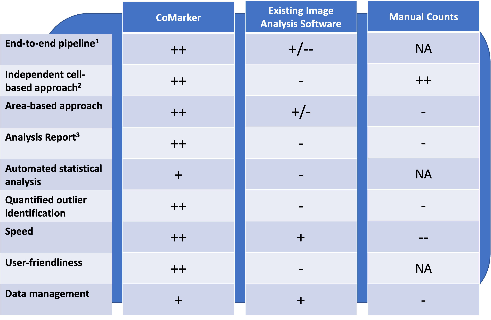

# Functions and Capabilities

The idea behind CoMarker is to allow for a cell-based approach to marker colocalisation analysis, therefore for the purpose of this manual we will discuss the capabilities of the script for when a nuclei marker is used. If you plan to use the script without a nuclei marker, similar procedures apply, however instead of counts the output will be the total area containing each marker for each image.

## What does CoMarker do?

-   Counts the number of regions of interest.

-   Finds the total area of the regions of interest.

-   Counts the number of cells (based on a 1:1 ratio with the number of nuclei).

-   Counts the number of cells which contain a reference marker signal.

-   Counts the number of cells within and outside of a region of interest which contain a reference marker.

-   Counts the number of cells which contain each marker signal.

-   Counts the number of cells within and outside of a region of interest which contain each marker.

-   Counts the number of cells positive for both the reference marker and each other marker (colocalised).

-   Counts the number of cells within and outside of a region of interest positive for both the reference marker and each other marker (colocalised).

-   Identifies image outliers and potential poor quality images (based on count distribution).

-   Presents the proportion of marker-positive cells throughout the image and within the region of interest.

-   Presents the proportion of reference marker-positive cells which are colocalised with each other marker, both respective and irrespective of the region of interest.

-   Performs statistical test to assess the differences between specified groups of interest (i.e disease vs control)

-   Produces a report, displaying a range of analysis graphs, parameters used and image outliers.

## Functionality Comparison

^1^ We refer to CoMarker as an end-to-end pipeline due to its ability to perform a comprehensive analysis, from raw image to analysis report, independent of external software.

^2^ CoMarker performs its cell-based analysis independent of external software and doesn't require a mask input.

^3^ CoMarker produces a user-friendly, presentable, and interactive analysis report with annotated statistical significance.

## Capabilities

-   1 region of interest marker (E.g. GLUT1 - Brain blood vessel marker)

-   1 reference marker (e.g. Iba1 - Microglial marker)

-   1 nuclei marker (e.g. DAPI)

-   Up to 5 general markers (e.g. CD68 - Microglial activation marker)
