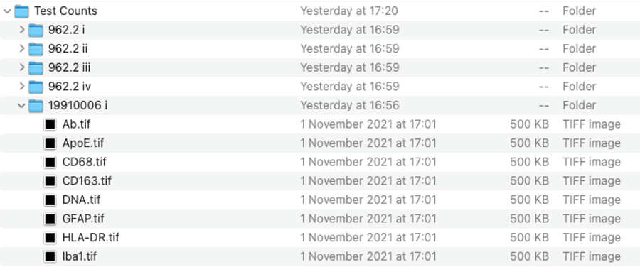

# Image/File Formatting

## Image Formatting

Images must be saved as the name of the marker followed by '.tif' - e.g., 'Iba1.tif', 'DNA.tif'.

## File Formatting

The source files should be organised as such:

Image Directory -\> One folder per patient per technical replicate -\> Marker.tif

In the analysis, files sharing the same case ID will be identified and within subject data will be averaged.

## Metadata Formatting

The metadata must be stored in the image directory as 'metadata.csv' and should be organised such that, as a bare minimum, it has columns for case IDs and the respective outcome variable (i.e. disease vs control). Additional columns may specify further outcomes to be investigated (i.e. genetic variants).

The heading of the case ID column must state 'CaseID' with no space to allow for effective processing in the R script.

## Example Directory Format

{width="600"}
