# ImageJ Script Walkthrough

This section of the manual will provide an overview of the steps taken in the ImageJ script, starting with the input parameters required for the script to function, followed by a walkthrough of how each marker is analysed.

## Specifying Parameters

When the ImageJ script is ran, the following dialog boxes will appear one at a time, with the latter dialog boxes changing depending on the initial inputs. It is important to find parameters that work best for each marker. A useful resource for information about markers is the [Human Protein Atlas](https://www.proteinatlas.org). Checking what markers should look like will help to guide decisions on parameters such as minimum area and thresholding method.

### Dialog Box (1/3)

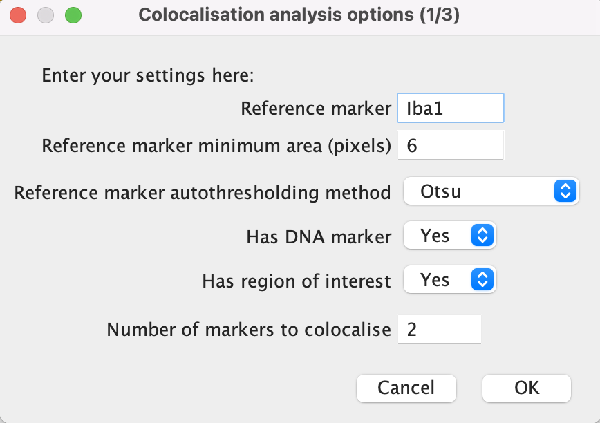{width="400"}

**Reference marker:** Add here the name of the reference marker to be analysed. The name should match the image file name minus the '.tif'.

**Minimum area:** This refers to the minimum number of pixels a marker signal is required to cover in order to be analysed. It is desired to eliminate as much noise as possible while keeping all relevant signal. It would be a good idea to look at a few sample images when determining the minimum area.

**Autothresholding method:** Select an autothresholding method from the drop-down menu. See the thresholding section of this manual for more information.

**Has DNA marker:** select "Yes" if a nuclei marker or present or "No" if not. The image name should always be 'DNA.tif'.

**Has region of interest:** "Yes" if the study involves a region of interest (ROI) or "No" if not.

**Number of markers to colocalise:** Input here the number of markers that you wish to analyse in addition to the reference, nuclei and ROI markers.

Click 'OK' once done.

### Dialog Box (2/3)

{width="400"}

**Marker colocalisation radius:** this refers to the maximum proximity two markers can be in order to be deemed to be colocalised. This radius applies to reference marker-marker and (reference) marker-DNA colocalisation.

**Region of interest:** Input the ROI marker here, ensuring that the name of the marker matches that in the file name.

**Use Gaussian and Watershed on ROI:** Select either "Yes" or "No". If "Yes", this function blurs the ROI signal, before using a Watershed transform to segregate them. This is useful when the ROI signal is fragmented and is not densely populated within the region.

**ROI minimum area:** If the answer was "Yes" to the previous input, then the minimum area should be higher as any gaps left by sparse markers will be filled by the blur.

**Radius around ROI:** This allows for the region of interest to be expanded around the marker signal. If this is not desired set the value to 0.

Click 'OK' once done.

### Dialog Box (3/3)

{width="400"}

State in this section the names of the markers to analyse, along with the minimum size and autothresholding method.

Click 'OK' once done.

Open the image directory in the pop-up finder.

The script will now run automatically.

## Region of Interest

### Overview of Steps

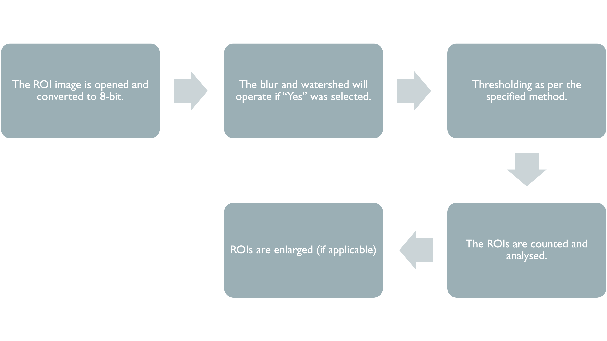

### Gaussian Blur

The Gaussian blur function takes the average of the signal in all pixels within a given radius. For our function, we use a radius of 5 pixels after extensive comparisons.

The blur is a means of resolving a problem faced when dealing with disperse or fragmented markers, such as amyloid-beta. Below is an example of the effects of the Gaussian blur on a slide stained for amyloid-beta.

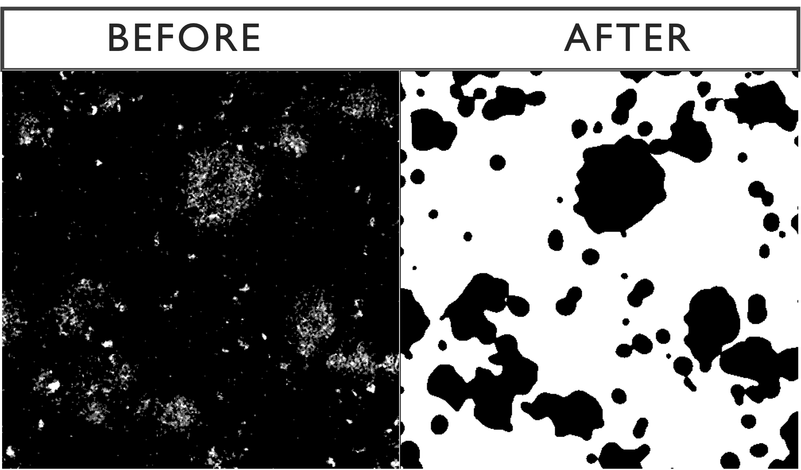

### Watershed Transform

The Gaussian blur can cause clusters of signal to merge into each other so we use a watershed transform to separate those signals, as seen below.

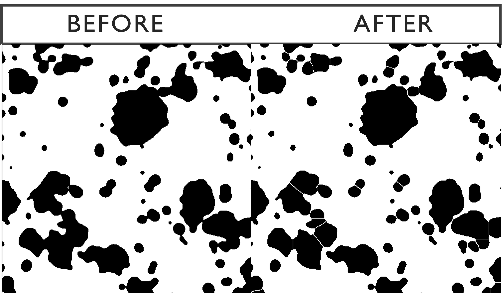

### Particle Analysis

The next step is to run the analyse particles function, using the specified minimum area. Below is the outcome of the optional Gaussian-watershed function with a default minimum area of 1100 pixels compared with the raw image. The sensitivity of the function can be modified by changing the minimum size.

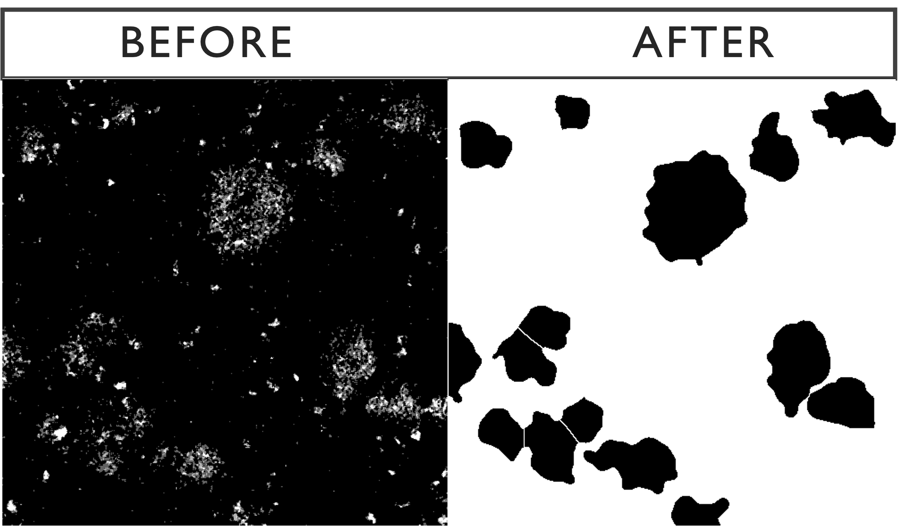

### Enlargement

Find here an example of a 30 pixel enlargement on the region of interest. The extent of the enlargement is to be specified by the user.

{width="350"}

## Nuclei

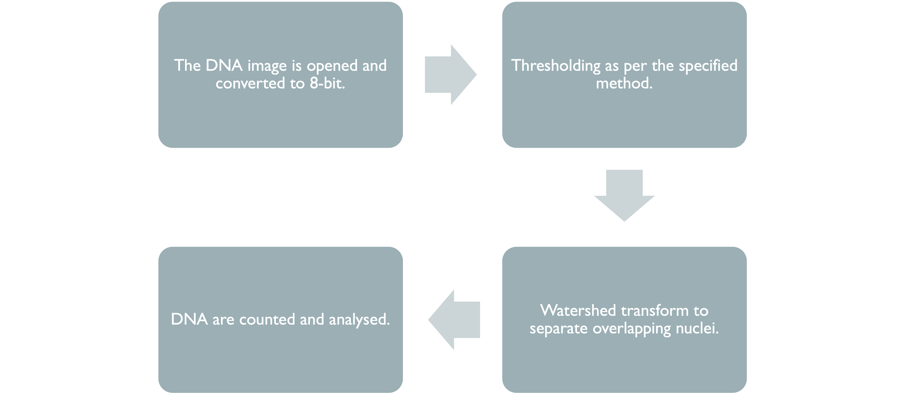

### Thresholding

The chosen threshold ultimately determines how much signal is included in the processed image. Our default threshold for DNA is 'Otsu' as it is a good mid-range threshold which includes as much signal as possible whilst eliminating noise.

Otsu thresholding returns a single intensity threshold determined by minimizing intra-class intensity variance, or equivalently, by maximizing inter-class intensity variance.

### Watershed

The watershed transform is used here to separate overlapping DNA signal in the 2D image.

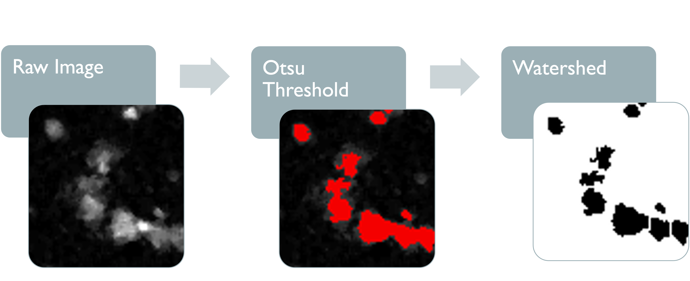

### Particle Analysis

DNA signal is then counted and analysed. Each DNA count represents a cluster of touching pixels with an area larger than the specified minimum area. We have set the default minimum area as 4 pixels due to some cells having nuclei with a diameter as small as 2 microns, thereby covering at least 4 pixels. Most nuclei, however, are larger than this, so it may be beneficial to increase the minimum area depending on the study.

## Reference Marker

### Thresholding

Our default threshold for the reference marker is 'Otsu' as it is a good mid-range threshold which includes as much signal as possible whilst eliminating noise.

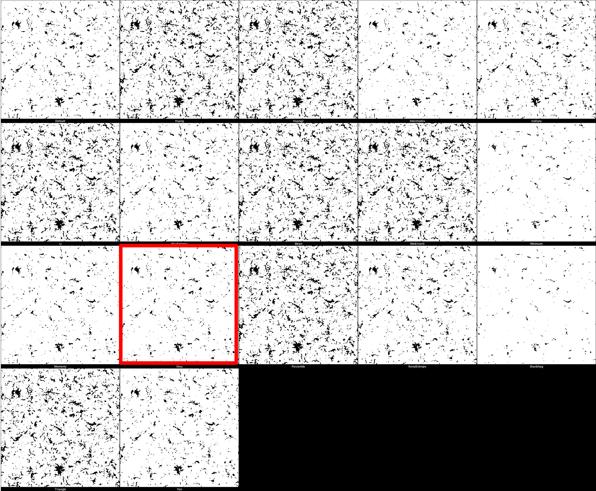

### Particle Analysis

Reference marker-positive cells are identified by overlaying enlarged reference marker signal and DNA. Here, we present several close-up images to display how the script recognises each positive cell and avoids false positives/negatives. The images show our reference marker (Iba1) in red, merged with DNA in cyan.

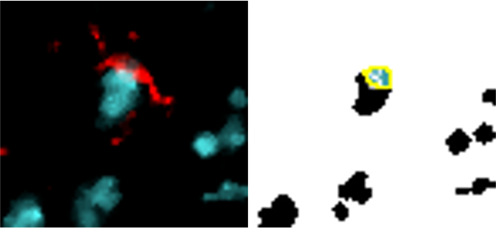{width="400"}

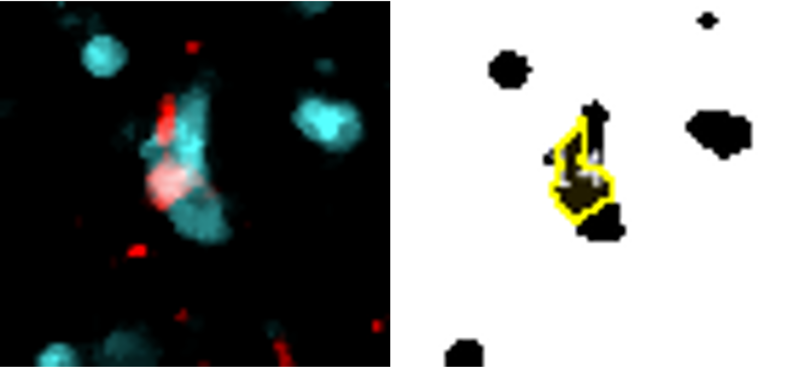{width="410"}

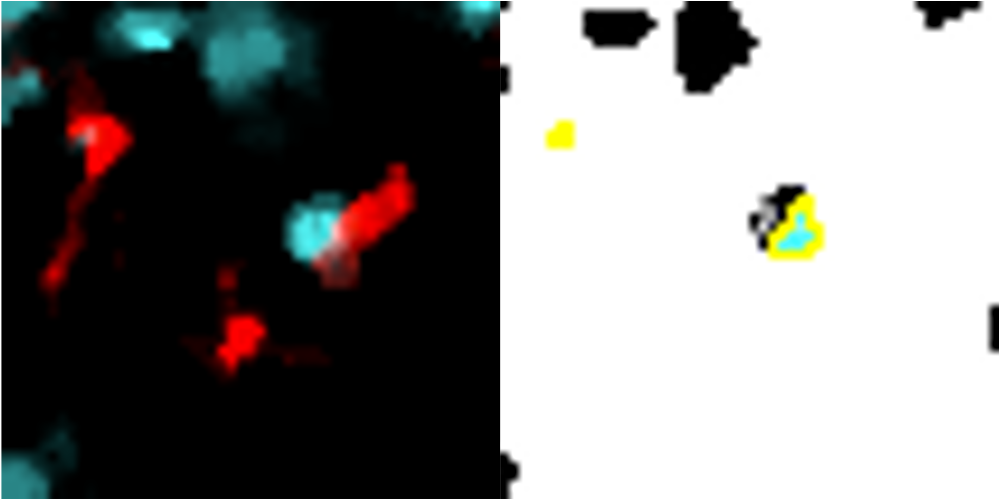{width="400"}

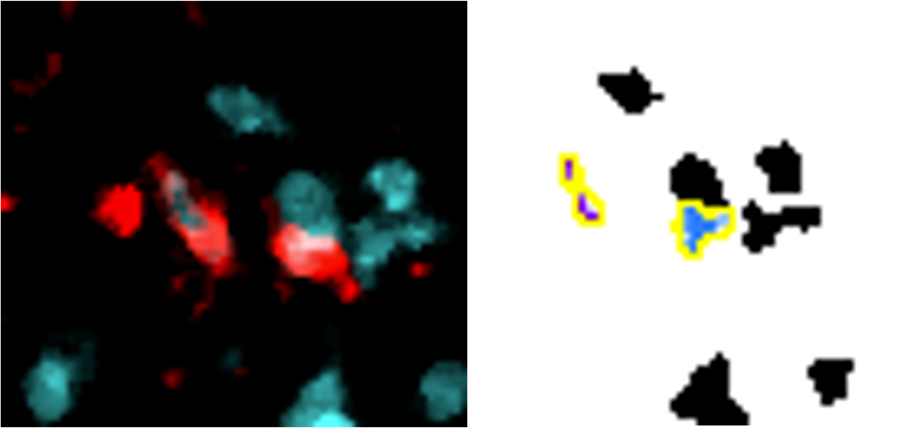{width="400"}

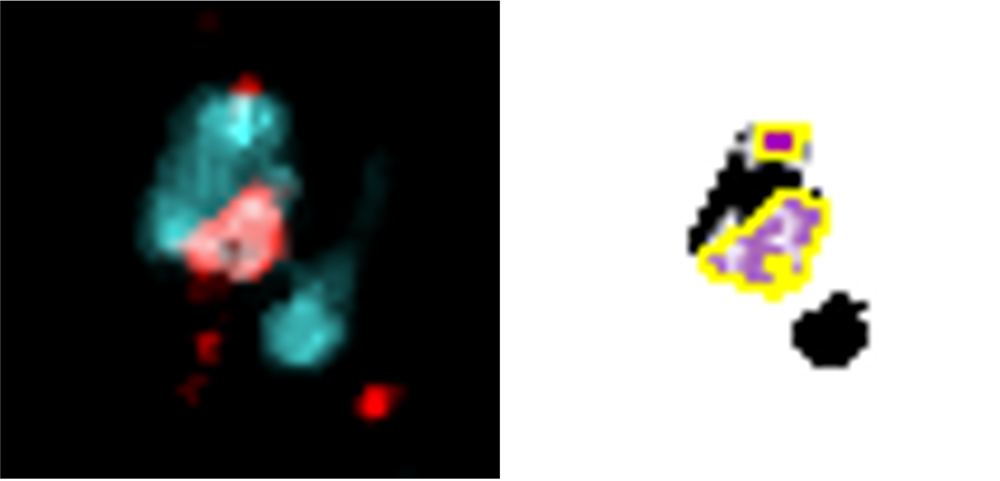{width="410"}

Reference marker cells within the ROI are simply these detected cells which are situated within the enlarged region of interest.

## Colocalisation Markers

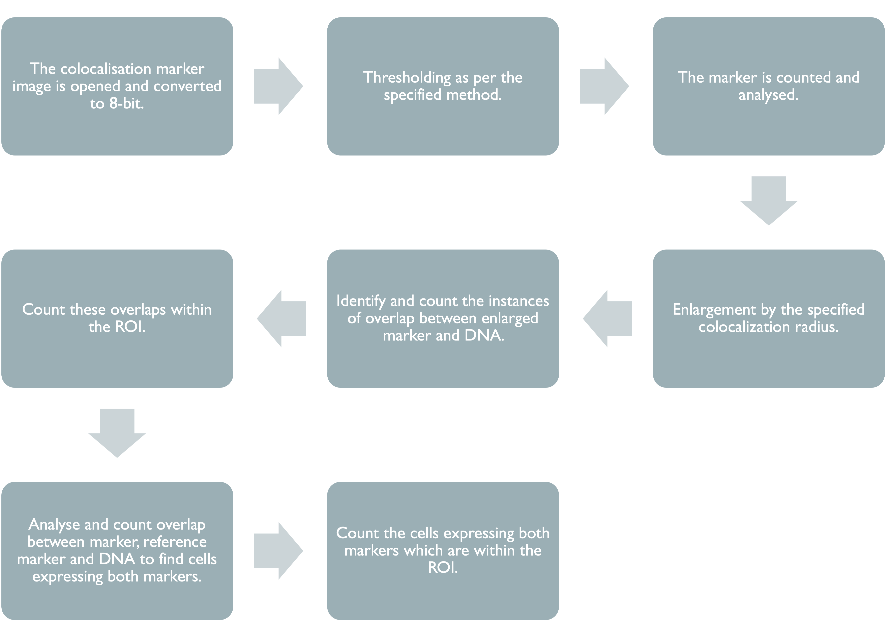

This section of the code is identical for each of the colocalisation markers used, however different minimum areas and thresholds can be used.

### Thresholding

The default threshold is again set to 'Otsu' which we recommend due to its balance between removing noise and retaining useful signal. It is important, however, that different thresholds for each marker. Thresholding montages can be produced in FIJI ImageJ through Image -\> Adjust -\> Auto Threshold -\> Try All. Find here a few example thresholding montages.

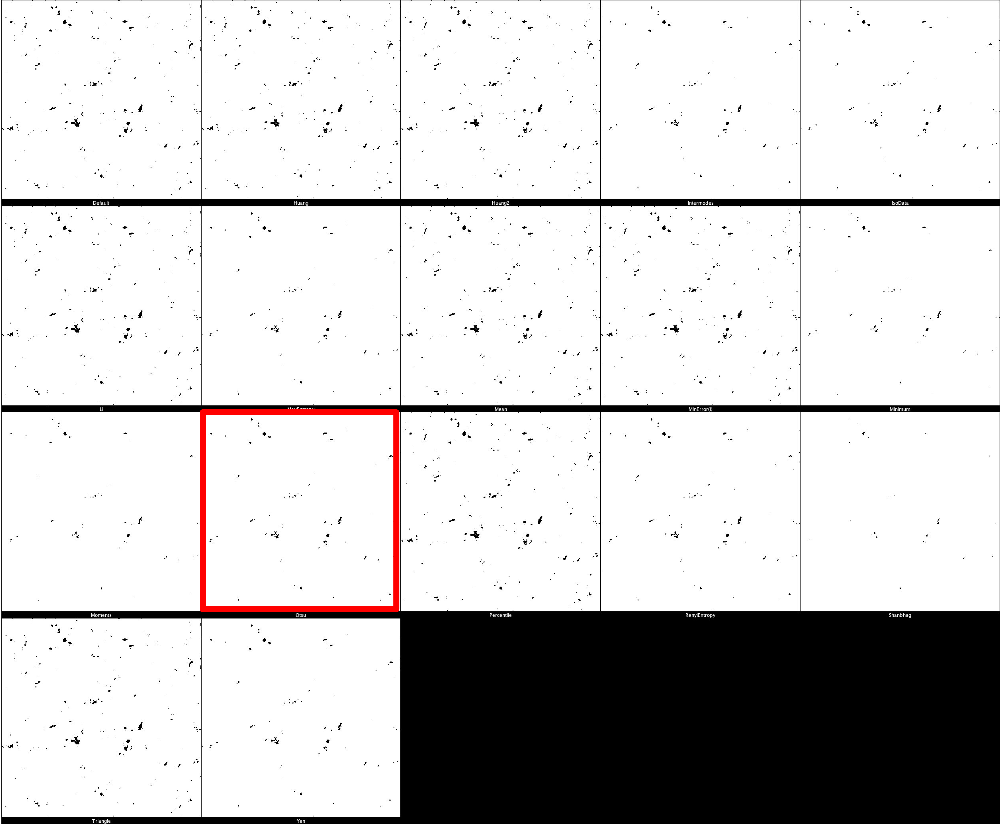

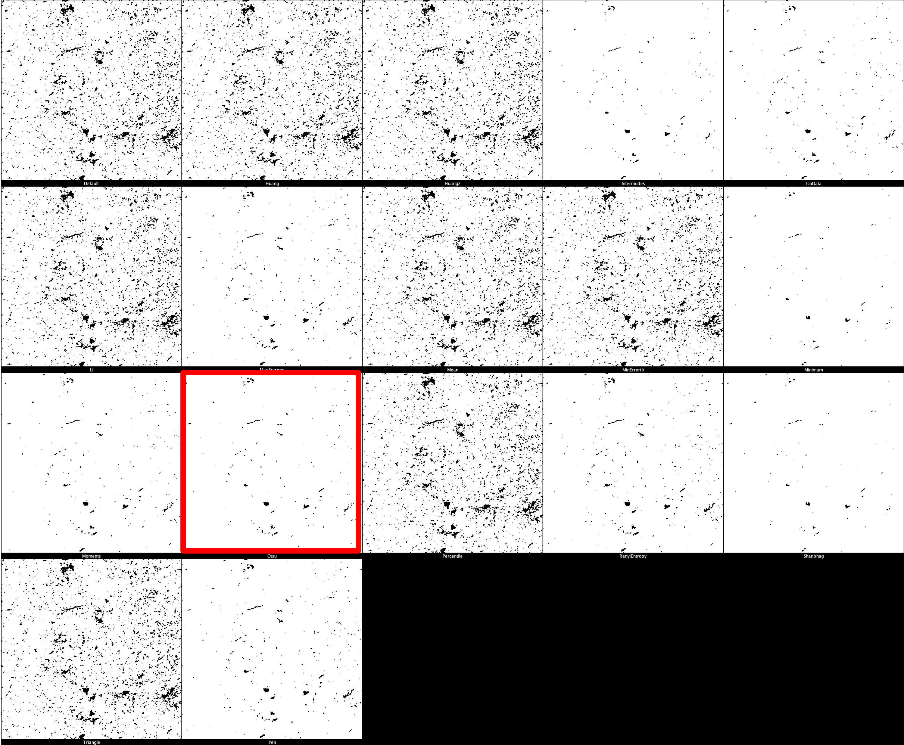

### Particle Analysis {#particle-analysis-3}

Colocalisation marker-positive cells by the same processes as reference markers. (See here [Particle Analysis](#particle-analysis-3)).

## Output

The ImageJ script output consists of a results table for every case. These results tables are collated and read by the R script.
