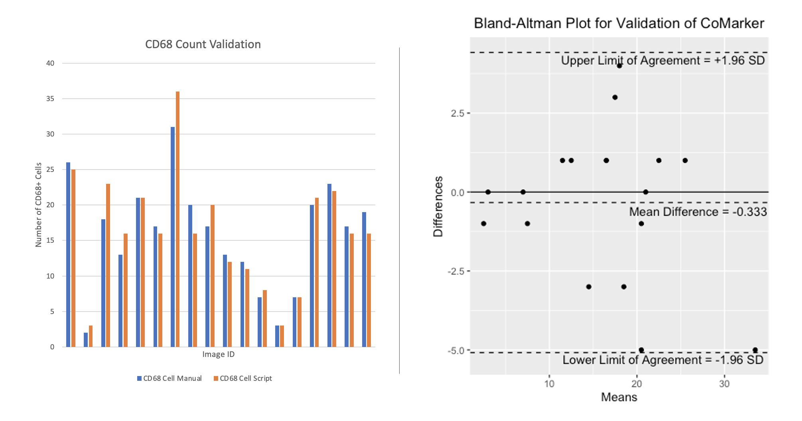
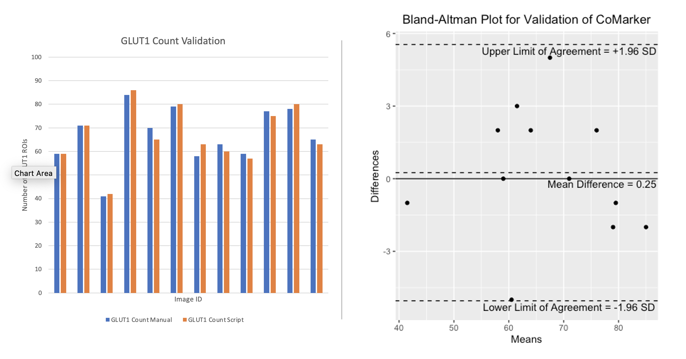
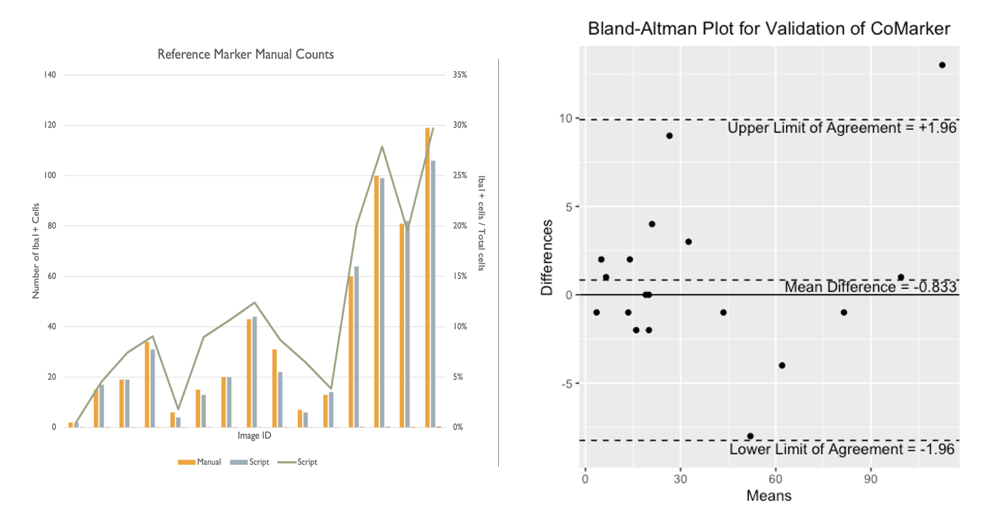
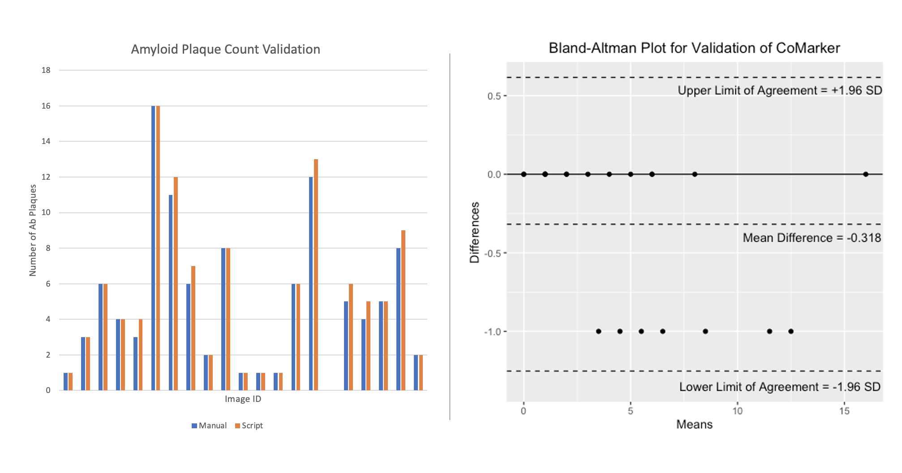

# Validation

## Manual Counts Comparison

Here we present a comparison between the script and blind manual counts. The aim of the code is to imitate manual counts while speeding up the time taken to analyse collections of images. Counts were obtained by both internal and external researchers, with the method of analysis being to count signal within 2 microns of DNA (except for ROI counts). Images IDs have been removed from the plot for privacy purposes. The results from these comparisons show that the script counts marker signal/positive cells accurately, and we aim to add more manual count data to the comparison in the near future.

The comparisons below compare counts produced by CoMarker and manual counts for the same images. The bar charts on the left display the paired counts, while the Bland-Altman plots on the right show the difference between the count values for each image with respect to a 95% confidence interval.

### CD68 - Colocalisation Marker

###  GLUT1 - Region of Interest

###  Iba1 - Reference Marker

### {alt="Reference Marker Count Validation"} Amyloid-beta - Region of Interest 
